# Matcha Bot

A drink-recipe (tea, matcha, etc.) consulting chatbot for a shop, served over Telegram, plus an admin dashboard for running and monitoring it.

## Key features

- **RAG chatbot** on Telegram and in the admin panel's Chat tab: a LangGraph agent (`fetch_history → retrieve → generate`, `app/agent/graph.py`) answers customers via OpenAI, grounding responses on uploaded recipe documents retrieved from a Chroma vector DB — never invents a drink/ingredient outside those documents (`backend/SOUL.md` defines the bot's personality and tone, editable from the Personality page without a restart). A favourite drink, a customer note (allergy/preference), and a rolling conversation summary are inferred and saved in the background after each reply, and past recommendations are tracked so the bot doesn't blindly repeat itself.
- **Per-account chat memory**: anyone can register a web account (`POST /auth/register`) and chat with the bot from the panel's Chat tab — each account gets its own isolated history, favourites, notes and summary (backed by a shared internal "web" channel, `app/routers/admin_chat.py`). "Reset conversation" clears message history only; favourites/notes/recommendations persist.
- **Multi-channel, poll-based**: `ChannelManager` reconciles one long-polling task per active Telegram channel (`app/channel_manager.py`, `app/telegram_poller.py`) — no inbound HTTP webhook is exposed. Each channel's bot token is encrypted with AES-GCM (`app/crypto.py`) before being stored. Deleting a channel **soft-deletes** it by default (its users and their memory are kept; re-adding a channel with the same bot token revives the same row); `?force=true` permanently erases the channel and every one of its users' memory.
- **React admin SPA**:
  - Chat: talk to the bot as the signed-in account, with real memory (not a stateless test chat).
  - Channels: create/edit/delete (soft or permanent), test connection (checks the token still works).
  - Docs: upload/list/delete the recipe documents that back the bot's knowledge base (long documents are pre-chunked before embedding).
  - Personality: edit the bot's tone/persona (`SOUL.md`) live.
  - Users: list/block/unblock users per channel.
  - Access log & Audit log: access history and admin action history (filter by action, search, danger badges).
  - Usage: token usage tracking (chart by model) for OpenAI calls, with an optional daily per-customer token cap.
- **30-day retention**: inactive customers' message history is purged on a background loop (`app/retention.py`), based on `users.last_active_at`.
- **Switchable LLM provider**: a Settings page selects OpenAI or any OpenAI-compatible endpoint (Ollama) and the chat model, stored encrypted in the database and effective without a restart (`app/llm_settings.py`, `app/routers/admin_llm_settings.py`). Embeddings stay on OpenAI's `text-embedding-3-small`, because the Chroma index depends on it. The shared OpenAI client keeps its HTTP connection warm for 5 minutes (`app/agent/clients.py`) so a reply doesn't re-pay a slow TLS handshake on every turn.
- **Auth**: Basic Auth for the admin dashboard — either the `.env` admin (`ADMIN_USERNAME` / `ADMIN_PASSWORD`) or any registered account.

## Architecture / stack

System diagram: [`docs/architecture-diagram.html`](docs/architecture-diagram.html) (animated, open in browser) / [`docs/architecture-diagram.svg`](docs/architecture-diagram.svg) (static image). A camera-tour version that pans/zooms across client → gateway/backend → data/AI → observability is at [`docs/architecture-full-camera-acts.html`](docs/architecture-full-camera-acts.html).



| Layer | Tech |
|---|---|
| Backend | FastAPI, SQLAlchemy + Alembic, LangGraph (agent graph: fetch_history → retrieve → generate, plus background extractors for favourites/notes/summary/recommendations) |
| Vector DB | ChromaDB |
| LLM | OpenAI API |
| Database | SQLite (default) / PostgreSQL supported via `DATABASE_URL` |
| Frontend | React + TypeScript + Vite, Tailwind CSS, React Router |
| Telegram | Per-channel long-polling (`telegram_poller.py`, `telegram_client.py`) |
| Infra | Docker Compose (backend + frontend), Terraform (single EC2), GitHub Actions CI/CD |
| Monitoring | Prometheus, Grafana, node_exporter, cadvisor |

### Project layout

```
backend/
  app/
    agent/                 # LangGraph nodes: fetch_history, retrieve, generate + extractors (favourite, customer note, summary, recommendation)
    routers/                # HTTP routers: admin_channels, admin_chat, admin_docs, admin_logs, admin_usage, admin_users, admin_soul, admin_llm_settings, auth_register, health
    routers/webhook.py       # NOT an HTTP route — Telegram message-processing pipeline called by telegram_poller.py; also holds spawn_background_extractions, shared with admin_chat.py
    routers/admin_chat.py    # POST /admin/chat, GET/DELETE /admin/chat/history — the panel's own stateful chat, per signed-in account
    routers/auth_register.py # POST /auth/register — self-service web account creation
    routers/admin_llm_settings.py  # GET/PUT /admin/llm-settings, POST /admin/llm-settings/test
    routers/admin_soul.py     # GET/PUT /admin/soul — live-editable bot personality
    routers/metrics.py       # GET /metrics — Prometheus scrape endpoint (no auth, not exposed by nginx)
    db/                      # SQLAlchemy models (Channel, Account, User, Message, Favourite, CustomerNote, ConversationSummary, RecommendationHistory, Document, AdminAuditLog, TokenUsage) + session
    channel_manager.py    # spawns/reconciles one long-poll task per active Telegram channel
    telegram_poller.py    # per-channel long-poll loop (get_updates)
    telegram_client.py    # Telegram Bot API HTTP calls
    ingestion.py           # chunk + embed uploaded docs into Chroma (long documents are pre-split)
    retention.py           # background loop purging inactive customers' message history (30 days)
    crypto.py              # token/credential encryption (AES-GCM)
    retry.py                # single-retry wrapper used around LLM/embedding calls
    token_usage.py         # persists per-call token counts
    llm_settings.py        # active chat provider/model + daily token limit: DB-backed, env fallback, encrypted key
    metrics.py             # Prometheus collectors: tokens, cost, node latency, Telegram traffic
    config.py               # settings (env)
  SOUL.md            # bot personality / tone (editable live from the Personality page)
  migrations/        # Alembic
frontend/
  src/               # React SPA: api, auth, chat, channels, docs, users, logs, usage, personality, welcome, layout
infra/               # Terraform: EC2, security group, Elastic IP, SSM secrets (see infra/README.md)
monitoring/          # Prometheus scrape config + alert rules, provisioned Grafana dashboard
docs/                # architecture diagram + design specs/plans (see below)
sample-recipes/      # sample recipes for testing ingestion/RAG
docker-compose.yml       # local development (builds from source)
docker-compose.prod.yml  # production stack on EC2 (GHCR images + monitoring)
```

## Deployment

The production stack runs on a single EC2 instance provisioned by Terraform.
See [`infra/README.md`](infra/README.md) for bootstrap, rollback, and routine
operations. Deploys are manual: run the `Deploy` workflow from the Actions tab.

The backend exports Prometheus metrics at `/metrics` — token counts, estimated
cost per model, per-node agent latency, retrieved chunk counts, and Telegram
traffic — scraped alongside host and container metrics and rendered by a
provisioned Grafana dashboard on port 3000. The endpoint is unauthenticated but
not published outside the Docker network.

## Running the project

### Docker Compose (recommended)

Copy `backend/.env.example` to `backend/.env` and fill in real values (see the environment variables table below), then:

```bash
docker compose up --build
```

- Backend: http://localhost:8000
- Admin frontend: http://localhost:80

### Running manually

**Backend**
```bash
cd backend
pip install -e ".[dev]"
alembic upgrade head
uvicorn app.main:app --reload
```

**Frontend**
```bash
cd frontend
npm install
npm run dev
```

## Admin API

All routes below require HTTP Basic Auth (`app/auth.py`, `require_admin` — the `.env` admin or any registered account), except `/health` and `/auth/register`.

| Method | Path | Purpose |
|---|---|---|
| POST | `/auth/register` | Create a web account (no auth) |
| POST | `/admin/chat` | Chat as the signed-in account, with real per-account memory |
| GET/DELETE | `/admin/chat/history` | The caller's last 50 messages / reset their conversation (favourites, notes, recommendations survive a reset) |
| GET/POST | `/admin/channels` | List (soft-deleted ones excluded) / create a Telegram channel — re-adding the same bot token revives a soft-deleted channel |
| POST | `/admin/channels/test` | Test a bot token before saving |
| GET/PUT | `/admin/llm-settings` | Read / update the active LLM provider, chat model and daily per-customer token limit |
| POST | `/admin/llm-settings/test` | Test a provider configuration before saving |
| GET/PUT | `/admin/soul` | Read / update the bot's personality (`SOUL.md`), effective immediately |
| PATCH | `/admin/channels/{id}` | Update a channel (404 if soft-deleted) |
| POST | `/admin/channels/{id}/test` | Test a saved channel's token |
| DELETE | `/admin/channels/{id}` | Soft-delete a channel (keeps its users/memory); `?force=true` permanently erases the channel and every one of its users' memory |
| GET/POST | `/admin/docs` | List / upload a knowledge-base document (chunked + embedded into Chroma) |
| DELETE | `/admin/docs/{id}` | Delete a document and its chunks |
| GET | `/admin/users` | List users (message count, favourites, blocked status) |
| POST | `/admin/users/{id}/block` \| `/unblock` | Block / unblock a user |
| GET | `/admin/logs/access` | Paginated chat message log |
| GET | `/admin/logs/audit` | Paginated admin action log (filter by action / search) |
| GET | `/admin/logs/audit/actions` | Distinct audit action names |
| DELETE | `/admin/logs/audit/{id}` \| `/admin/logs/audit` | Delete one / clear all audit entries |
| GET | `/admin/usage` \| `/admin/usage/summary` | Token usage rows / per-model cost totals |
| DELETE | `/admin/usage/{id}` \| `/admin/usage` | Delete one / clear all usage rows |
| GET | `/health` | Liveness check (no auth) |

**Data model** (`app/db/models.py`): `Channel` (soft-deletable via `deleted_at`, matched by `token_hash`) → `User` → `Message` / `Favourite` / `CustomerNote` / `ConversationSummary` / `RecommendationHistory`; `Account` (web login, maps to a `User` on the internal "web" channel); standalone `Document`, `AdminAuditLog`, `TokenUsage`.

**Frontend routes** (`frontend/src/App.tsx`): `/` (public landing), `/login` (sign in or register), and `/panel/*` (auth-gated): `chat`, `usage` (default), `docs`, `personality`, `users`, `logs/access`, `logs/audit`, `channels`, `settings`.

## CI/CD

GitHub Actions (`.github/workflows/deploy.yml`) runs on every push to `main`:

1. **test** — installs backend deps, runs `pytest` (with dummy `OPENAI_API_KEY`/`ENCRYPTION_KEY`), then installs frontend deps and runs `npm run build` (typecheck + build).
2. **build-and-push** (needs `test` to pass) — builds the `backend` and `frontend` Docker images and pushes both to GHCR (`ghcr.io/<repo>-backend`, `ghcr.io/<repo>-frontend`), tagged `latest` and the commit SHA.

## Environment variables (backend/.env)

| Variable | Purpose |
|---|---|
| `OPENAI_API_KEY` | API key for retrieve/generate calls to OpenAI |
| `CHROMA_PERSIST_DIR` | Directory where the vector DB is persisted |
| `ENCRYPTION_KEY` | Key used to encrypt each channel's bot token |
| `DATABASE_URL` | DB connection string (defaults to SQLite) |
| `ADMIN_USERNAME` / `ADMIN_PASSWORD` | Admin dashboard login credentials |

Never commit a real `.env` file — it's already blocked by `.gitignore` at both the root and per-package level.

## Tests

```bash
# backend
cd backend && pytest

# frontend
cd frontend && npm run test
```

## Design docs

`docs/architecture-diagram.{html,svg}` and `docs/architecture-full-camera-acts.html` — the system diagrams above.
`docs/test-plan-full-coverage.md` — a manual test checklist across every feature (auth, chat memory, multi-user isolation, channels, docs, personality, settings, retention, logs, latency).
Local implementation plans/specs (`docs/superpowers/`) are kept on disk for reference but are gitignored, not part of the repo history.
